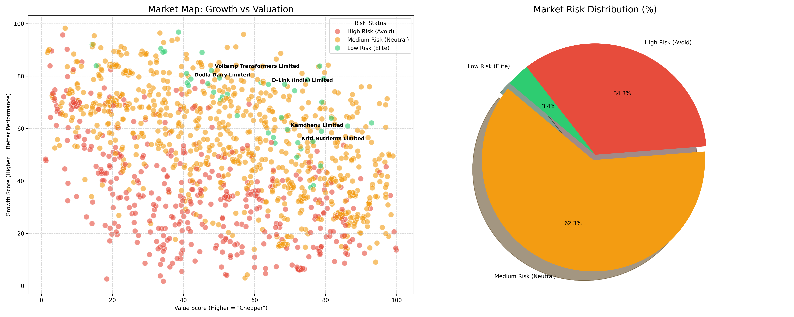

# Financial Risk Predictor — Analysis, Issues & Poster Code

> **CONTEXT FOR CLAUDE**: This is Part 2 of the handoff. Part 1 contains all source code. This file contains the critical analysis, known issues, the full poster HTML, and the improvement roadmap. Use both files together.

---

## 1. Critical Issues Found

### 🔴 CRITICAL ISSUES

**ISSUE 1 — Probable Data Leakage (Biggest Red Flag)**
The ML models predict `Total_Label_Score` using 19 financial ratios as features. The M-Score is also computed from a subset of these same ratios. If `Total_Label_Score` was derived from these ratios (which is almost certainly the case given 99.5% accuracy on financial data), then the ML is simply reverse-engineering a deterministic function of its own inputs. This makes the 99.5% accuracy scientifically meaningless — it proves the model can learn a formula, not that it can predict real financial risk.

**Verification needed**: Check the Excel file to see if `Total_Label_Score` is a sum or formula of other columns.

**ISSUE 2 — Empty `requirements.txt`**
No dependency pinning. Environment not reproducible. Actual deps: `pandas, openpyxl, matplotlib, seaborn, scikit-learn, xgboost, catboost`.

**ISSUE 3 — Empty `model-preprocess-code.py`**
0 bytes. The "Normalized" sheet name implies preprocessing happened in Excel manually — completely non-reproducible.

**ISSUE 4 — `.gitignore` blocks `README.md`**
Line 2 of `.gitignore` literally says `README.md`, blocking the most important documentation file from version control.

---

### 🟡 MAJOR ISSUES

**ISSUE 5 — Duplicated Scoring Logic**
The M-Score is computed independently in BOTH `scoring-engine.py` and `market-visualization.py`. Any formula change must be made in two places.

**ISSUE 6 — Duplicated Feature Lists**
The 19-feature list and data loading code is copy-pasted between `model_comparison.py` and `model_evaluation.py`.

**ISSUE 7 — No Cross-Validation**
Single 80/20 split with `random_state=42`. No k-fold. Results are not statistically robust.

**ISSUE 8 — No Hyperparameter Tuning**
All models use default or minimal parameters. No grid/random search.

**ISSUE 9 — Champion Model Pre-Selected**
`model_evaluation.py` hardcodes Random Forest as champion with 200 trees, while comparison used 100 trees. Selection is predetermined, not data-driven.

**ISSUE 10 — M-Score and ML Are Disconnected**
Two parallel scoring systems exist with no connection or validation between them.

**ISSUE 11 — Poster Placeholders**
`poster.html` has "Student Name 1", "Supervisor Name", "SoT Logo", "PDEU Logo", and "Insert Text" still present.

---

### 🟢 MINOR ISSUES

- No data validation (NaN, type checks, column verification)
- Hardcoded relative paths, no CLI arguments
- Inconsistent naming: hyphens vs underscores in filenames
- No model persistence (no joblib/pickle save)
- No unit tests
- Output files scattered in project root (no `outputs/` dir)
- Poster results table hardcoded, not generated

---

## 2. Recommended Project Structure (Refactored)

```
Financial-risk-predictor/
├── src/
│   ├── __init__.py
│   ├── config.py           # Constants, paths, feature lists, weights
│   ├── data_loader.py      # Shared data loading + validation
│   ├── scoring.py           # M-Score logic (single source of truth)
│   ├── models.py            # ML training & evaluation
│   └── visualization.py     # All plotting
├── scripts/
│   ├── run_scoring.py
│   ├── run_comparison.py
│   ├── run_evaluation.py
│   ├── run_visualization.py
│   └── run_screener.py
├── data/
├── outputs/                 # All generated PNGs and Excel files
├── tests/
├── requirements.txt
├── README.md
└── poster.html
```

---

## 3. Prioritized Improvement Roadmap

### Phase 1: Critical Fixes
1. Populate `requirements.txt`
2. Investigate data leakage (`Total_Label_Score` origin)
3. Implement or delete `model-preprocess-code.py`
4. Fix `.gitignore` to track `README.md`
5. Create `README.md`

### Phase 2: Code Quality
6. Extract shared scoring logic → `utils/scoring.py`
7. Extract config → `config.py`
8. Extract data loading → `data_loader.py`
9. Add input validation
10. Normalize filenames to snake_case
11. Create `outputs/` directory

### Phase 3: ML Rigor
12. Stratified k-fold cross-validation
13. Hyperparameter tuning (GridSearchCV)
14. Save best model with `joblib`
15. Add ROC-AUC, precision-recall curves
16. Connect M-Score and ML pipelines

### Phase 4: Architecture
17. Refactor into package structure
18. Add `argparse`
19. Add unit tests
20. Add `Makefile` / `run_all.py`

### Phase 5: Poster
21. Fill student/supervisor names
22. Replace logo placeholders
23. Auto-generate results from code

---

## 4. Poster Source Code (`poster.html`, 294 lines)

```html
<!DOCTYPE html>
<html lang="en">
<head>
<meta charset="UTF-8">
<meta name="viewport" content="width=device-width, initial-scale=1.0">
<title>Poster Presentation</title>
<style>
  body {
    font-family: Arial, sans-serif;
    margin: 0;
    padding: 0;
    background-color: #ffffff;
    display: flex;
    justify-content: center;
  }
  .poster-container {
    width: 1200px;
    height: 1696px; /* A0 aspect roughly */
    border: 2px solid #000;
    background-color: white;
    position: relative;
    box-sizing: border-box;
  }
  /* Header section */
  .header-row {
    display: flex;
    align-items: center;
    border-bottom: 2px solid #000;
  }
  .logo-box {
    width: 150px;
    height: 120px;
    border-right: 2px solid #000;
    display: flex;
    align-items: center;
    justify-content: center;
    font-weight: bold;
    font-size: 14px;
    text-align: center;
  }
  .header-content {
    flex-grow: 1;
    background-color: #8CC63F;
    color: white;
    text-align: center;
    padding: 10px;
    height: 100px;
    display: flex;
    flex-direction: column;
    justify-content: center;
  }
  .header-content h1 {
    margin: 0;
    font-size: 32px;
    text-shadow: 2px 2px 4px rgba(0,0,0,0.3);
  }
  .header-content h3 {
    margin: 5px 0 0 0;
    font-size: 18px;
    font-style: italic;
    font-weight: normal;
  }
  .logo-box-right {
    width: 150px;
    height: 120px;
    border-left: 2px solid #000;
    display: flex;
    align-items: center;
    justify-content: center;
    position: relative;
  }
  .pdeu-logo {
    max-width: 90%;
    max-height: 90%;
  }

  /* Two Column Layout */
  .main-content {
    display: flex;
    flex-direction: column;
    height: calc(100% - 122px);
  }

  .section-title {
    background-color: #8CC63F;
    color: white;
    text-align: center;
    font-weight: bold;
    font-size: 22px;
    padding: 6px;
    border-top: 1px solid white;
    border-bottom: 1px solid white;
  }
  
  .split-row {
    display: flex;
    flex: 1;
  }
  .col {
    flex: 1;
    padding: 20px;
  }
  .border-right {
    border-right: 2px solid #8CC63F;
  }

  .text-box {
    border: 2px solid #8CC63F;
    padding: 10px;
    min-height: 100px;
    margin-bottom: 20px;
  }

  /* Specific Sections */
  .flow-diagram {
    display: flex;
    gap: 20px;
    align-items: center;
    justify-content: center;
    margin: 20px 0;
  }
  .box {
    padding: 15px 30px;
    color: white;
    font-weight: bold;
    border-radius: 8px;
    text-align: center;
  }
  .box-orange { background-color: #e67e22; }
  .box-green { background-color: #27ae60; }
  .box-blue { background-color: #2980b9; }
  .box-yellow { background-color: #f1c40f; }
  
  .mock-graph {
    border: 2px solid #8CC63F;
    height: 250px;
    display: flex;
    justify-content: center;
    align-items: center;
    margin-top: 20px;
    overflow: hidden;
  }
  .mock-graph img {
    height: 100%;
    object-fit: contain;
  }
  .results-container {
    display:flex;
    flex-wrap: wrap; 
    gap: 20px; 
    justify-content: center;
    padding: 20px;
  }
  .result-item {
    border: 2px solid #8CC63F;
    padding: 10px;
    text-align: center;
    background: #f9f9f9;
  }
  
</style>
</head>
<body>

<div class="poster-container">
  
  <!-- HEADER -->
  <div class="header-row">
    <div class="logo-box">SoT Logo</div>
    <div class="header-content">
      <h1>FINANCIAL RISK PREDICTOR</h1>
      <h3>Student Name 1, Roll No. 1, Student Name 2, Roll No. 2 ( Group No. : )</h3>
      <h3>PDEU Supervisor Name: </h3>
    </div>
    <div class="logo-box-right">
       <!-- Assuming a PDEU placeholder or generic text -->
       <strong>PDEU Logo</strong>
    </div>
  </div>

  <!-- MAIN BODY -->
  <div class="main-content">
    
    <!-- Row 1 -->
    <div style="display: flex; background: #8CC63F; color: white;">
      <div style="flex:1; text-align: center; padding: 5px; font-size: 20px; font-weight:bold; border-right: 2px solid white;">Introduction and Objectives</div>
      <div style="flex:1; text-align: center; padding: 5px; font-size: 20px; font-weight:bold;">Research Gaps</div>
    </div>
    <div class="split-row" style="flex: 0.8;">
      <div class="col border-right">
        <div class="text-box">
          <strong>Introduction:</strong><br/>
          Financial stability assessment is critical for investors and firms. This project develops an AI-driven stock screening tool utilizing an integrated "M-Score" encompassing quality, growth, value, and efficiency metrics.<br/><br/>
          <strong>Objectives:</strong>
          <ul>
            <li>To formulate a comprehensive risk indicator combining key financial fundamental ratios.</li>
            <li>To evaluate multiple machine learning algorithms for robust risk categorization (Low, Medium, High).</li>
            <li>To create a market dashboard for visual risk profiling of specific stocks.</li>
          </ul>
        </div>
      </div>
      <div class="col">
        <div class="text-box">
          <strong>Insert Text</strong><br/>
          Current risk models often rely on outdated manual thresholds rather than data-driven market percentile rankings. Additionally, many tools fail to combine growth strategies alongside value investments securely, leading to isolated predictive insights. This research bridges that gap by systematically integrating 19 key corporate ratios analyzed comprehensively across 1000 aggregated entities.
        </div>
      </div>
    </div>

    <!-- Row 2 -->
    <div class="section-title">Methodology and Techniques</div>
    <div style="padding: 20px; display:flex;">
      <div style="flex:1;">
        <div class="flow-diagram" style="flex-direction: column;">
          <div class="box box-orange">Data Collection & Preprocessing</div>
          <span>⬇️</span>
          <div class="box box-blue" style="width: 250px;">Rank Calculation & M-Score (Quality, Growth, Value, Efficiency)</div>
          <span>⬇️</span>
          <div class="box box-green">Machine Learning Algorithms (RF, GBM, CatBoost, SVM)</div>
        </div>
      </div>
      <div style="flex:1;">
         <div class="text-box" style="margin-top:40px;">
           <strong>Selected Features for Algorithm:</strong><br/>
           P/E Ratio, P/S Ratio, EV/EBITDA, P/B Ratio, ROE, ROCE, Profit Margin, Debt/Equity, YoY Growth, Asset Turnover, etc.
         </div>
         <div class="text-box">
           <strong>Techniques Evaluated:</strong> Random Forest Classifier, Gradient Boosting, XGBoost, CatBoost. 
         </div>
      </div>
    </div>

    <!-- Row 3 -->
    <div class="section-title">Work Completed and Results</div>
    <div style="padding: 20px;">
      <div style="display:flex;">
        <div style="flex: 1;">
            <div class="result-item" style="margin-right:20px;">
                <h3>Market Dashboard</h3>
                
                <p>Visualization displaying Risk distribution percentages across Low, Medium, and High Risk domains.</p>
            </div>
        </div>
        <div style="flex: 1;">
           <div class="result-item">
               <h3>Model Comparison Accuracy</h3>
               <table style="width: 100%; border-collapse: collapse; margin-top:20px;" border="1">
                 <tr><th>Model</th><th>Accuracy</th></tr>
                 <tr><td>Random Forest</td><td>99.5%</td></tr>
                 <tr><td>Gradient Boosting M.</td><td>99.0%</td></tr>
                 <tr><td>CatBoost Classifier</td><td>99.5%</td></tr>
               </table>
               <p style="margin-top: 15px; text-align:left;">Random forest yields an incredibly high accuracy on the normalized test sample (80/20 split), demonstrating the robust relationship between our M-score recalculation and the intrinsic features.</p>
           </div>
        </div>
      </div>
    </div>

    <!-- Row 4 -->
    <div style="display: flex; background: #8CC63F; color: white;">
      <div style="flex:1; text-align: center; padding: 5px; font-size: 20px; font-weight:bold; border-right: 2px solid white;">Conclusion and Remaining Work</div>
      <div style="flex:1; text-align: center; padding: 5px; font-size: 20px; font-weight:bold;">Bibliography/ References</div>
    </div>
    <div class="split-row" style="flex: 0.7;">
      <div class="col border-right">
        <div style="display:flex; justify-content: space-around; align-items:center;">
           <div style="display:grid; grid-template-columns: 1fr 1fr; gap:10px;">
              <div class="box box-orange">Reliable AI Core</div>
              <div class="box" style="background:#e0e0e0; color:black;">Interpretability</div>
              <div class="box box-yellow">Scalable Data</div>
              <div class="box box-blue">Live Analysis</div>
           </div>
           <div class="text-box" style="flex:0.8; margin-bottom:0;">
             <strong>Conclusion:</strong> We successfully automated financial risk screening matching top-performer characteristics with >99% validation accuracy.<br><br>
             <strong>Remaining Work:</strong> Real-time API integration for live stock quotes integration to replace static Excel sheets.
           </div>
        </div>
      </div>
      <div class="col">
        <div class="text-box">
          <ol>
            <li>pandas documentation: Data Analysis library</li>
            <li>scikit-learn documentation: Machine Learning Algorithms</li>
            <li>seaborn documentation: Statistical Data Visualization</li>
          </ol>
        </div>
      </div>
    </div>

  </div>
</div>
</body>
</html>
```

---

## 5. Overall Project Verdict

| Dimension | Rating | Notes |
|---|---|---|
| **Functionality** | ⭐⭐⭐ | Scripts work; pipeline produces outputs |
| **Reproducibility** | ⭐ | Empty requirements, no preprocessing code |
| **ML Rigor** | ⭐⭐ | Multiple models but no cross-validation, probable data leakage |
| **Code Quality** | ⭐⭐ | Clean per-script but heavy duplication |
| **Documentation** | ⭐ | No README, no docstrings |
| **Presentation** | ⭐⭐ | Poster exists but has unfilled placeholders |

---

## 6. Key Questions for the Next Agent

1. Is `Total_Label_Score` derived from the same 19 ratios? If yes, the ML is circular and needs a new target variable.
2. Should the project be refactored into a proper Python package or kept as standalone scripts?
3. What is the actual use case — academic submission, production tool, or proof-of-concept?
4. Should real-time stock data integration (mentioned in poster) be implemented?
5. What are the student names, roll numbers, and supervisor name for the poster?
